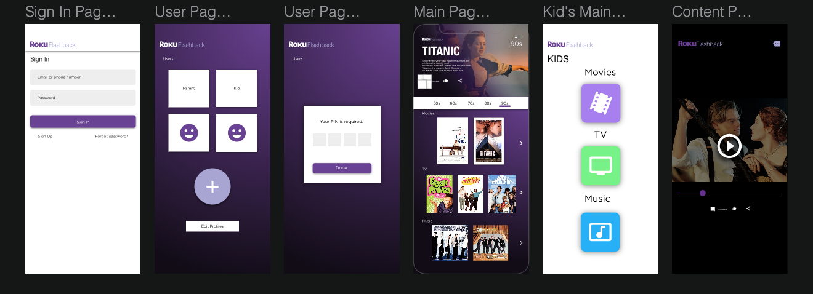

# ROKU Flashback Assignment

## Description
An audio and video app that uses queries and database assets. The user will be able to login and select either a parent section or a kids section, each with a unique theme. The parent section will require a password. Some content will be organized based on ratings and priveleges. 

## Getting Started
 >Clone the repo to your computer
 >Open in your preferred developing application
 >in terminal watch sass using : sass --watch sass:public/css --style compressed

 
### Dependencies
Vue.js
Used CSS3, SASS, HTML3, and Javascript. 

### Installing

To import the database: 
Access the db_rokudata sql document in the 'database' folder.

> Launch MAMP
In another terminal:
> create database db_movies_roku;
> use db_rokudata;
>source 

## Authors

Contributors names and contact info

* Derrik Campbell @DerrikC
* Graham Vickers @grahamvickers

## Version History

* 0.1
    * Initial Release

## License

MIT

## Acknowledgments

Code Support: 
Trevor Van Rys

Inspiration: 
Netflix
